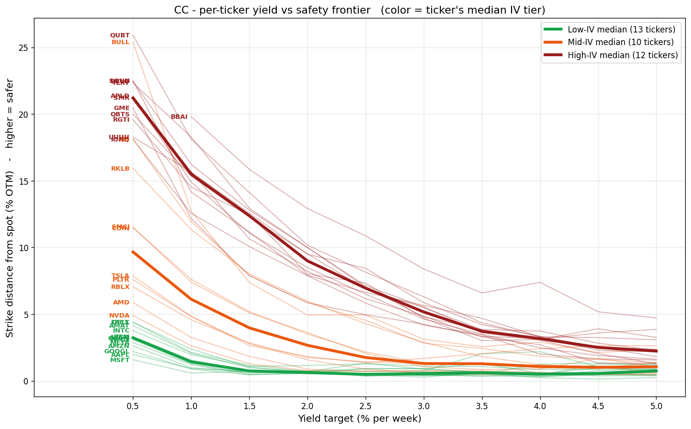
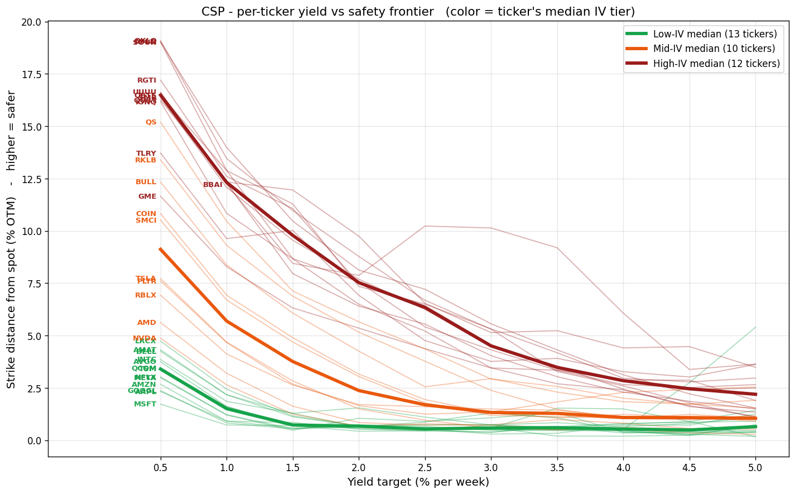
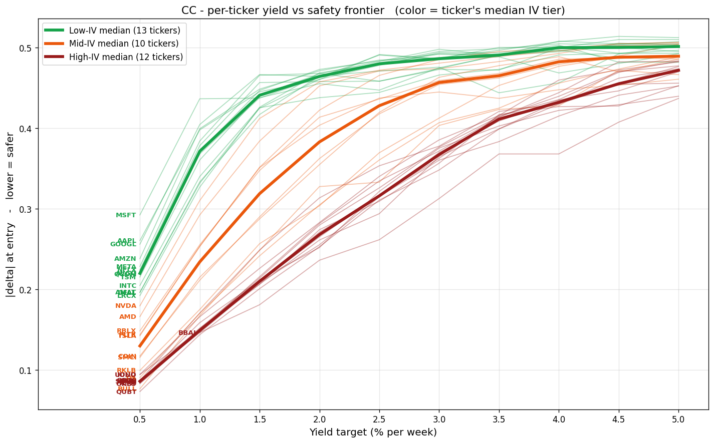
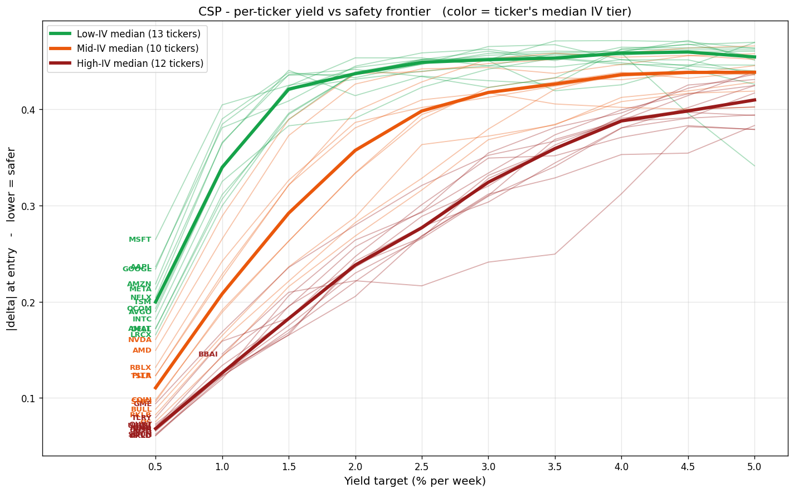
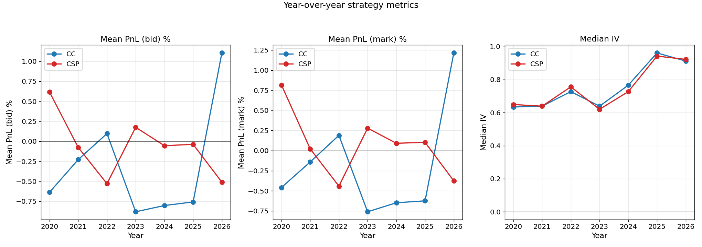
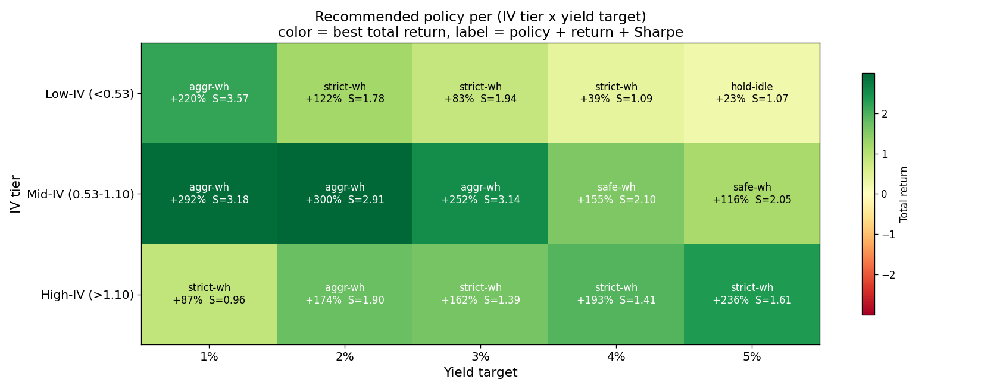
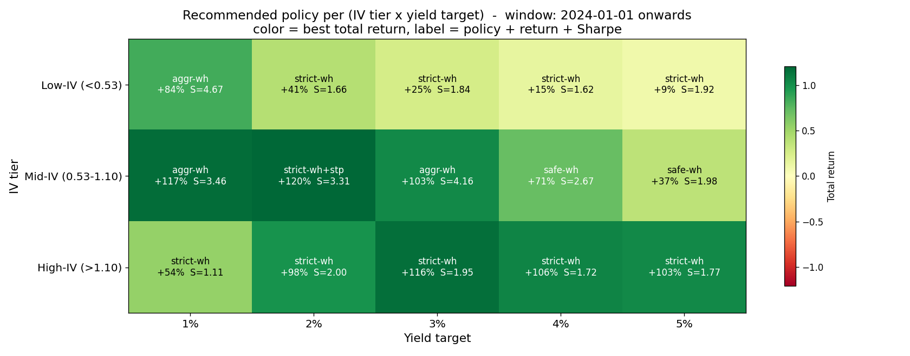
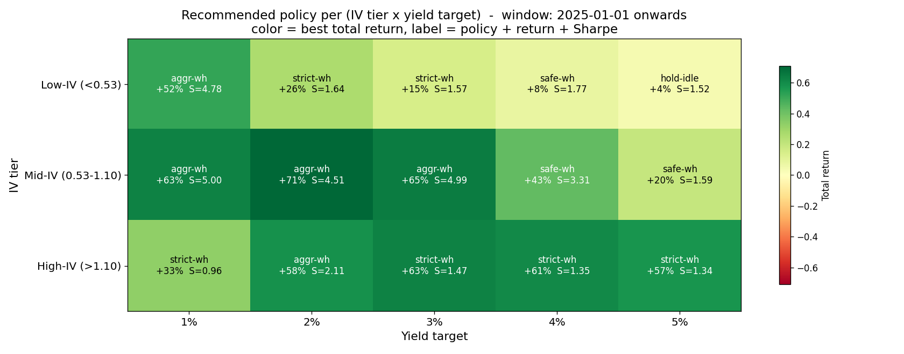
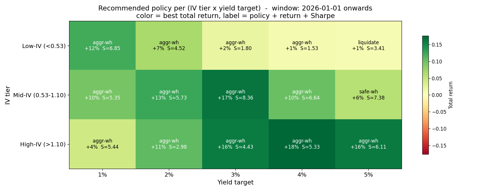

# AT82.04 - Option Screener with Price Prediction

A decision-support system for retail investors writing weekly options income trades (Cash-Secured Puts and Covered Calls). Built for AT82.04 Business Intelligence and Analytics at the Asian Institute of Technology.

For web application documentation, please go to [app/README.md](app/README.md).

## Table of contents
- [AT82.04 - Option Screener with Price Prediction](#at8204---option-screener-with-price-prediction)
  - [Table of contents](#table-of-contents)
  - [Notebook 00-01: universe collection and cleanup (65 → 59)](#notebook-00-01-universe-collection-and-cleanup-65--59)
    - [Data-source strategy](#data-source-strategy)
    - [Module split](#module-split)
  - [Notebook 02: the 59 -\> 35 filter funnel](#notebook-02-the-59---35-filter-funnel)
    - [Observations](#observations)
  - [Notebook 03: weekly strategy labels](#notebook-03-weekly-strategy-labels)
  - [Notebook 04: options EDA on the HQ universe](#notebook-04-options-eda-on-the-hq-universe)
    - [Per-ticker yield vs safety frontier](#per-ticker-yield-vs-safety-frontier)
    - [Year-over-year trend](#year-over-year-trend)
  - [Notebook 05: policy backtest across 9 strategies x 5 yield targets](#notebook-05-policy-backtest-across-9-strategies-x-5-yield-targets)
    - [The median-aggregation gotcha](#the-median-aggregation-gotcha)
    - [Recommended policy per (IV tier, yield target)](#recommended-policy-per-iv-tier-yield-target)
    - [Seven insights from the grid](#seven-insights-from-the-grid)
    - [Best combinations](#best-combinations)
    - [Late-start windows: 2024, 2025, 2026](#late-start-windows-2024-2025-2026)
    - [Cross-window takeaways](#cross-window-takeaways)

**Repository layout:**

- `experiments/` - Jupyter notebooks `00`-`06` that build the dataset, run the backtest, and train the price-prediction model. The rest of this README is the journal of that work.
- `app/` - production web application: FastAPI backend (`app/backend`) and SvelteKit/Svelte 5 frontend (`app/frontend`), plus the Docker Compose files that run them together. See `app/DEPLOY.md` for deployment.

---

## Notebook 00-01: universe collection and cleanup (65 → 59)

The project started from a 65-ticker watchlist of the authors' interest spanning AI, energy, semiconductors, quantum computing, robotics, and meme stocks. A single structural filter narrowed it before any strategy work began: six tickers were dropped because they had no options chain on Alpha Vantage: `EXOD`, `KOSS`, `QBTQF`, `QMCO`, `QNTM` (no options), plus `CCCX` which changed its symbol to `INFQ`. The surviving 59-ticker universe is maintained in `experiments/config.py` as `FILTERED_TICKERS` and is what the fetch scripts run against.

Notebook `01_initial_eda.ipynb` plotted per-ticker adjusted-close differences between Alpha Vantage and yfinance as a data-quality sanity check (output in `experiments/output/01_initial_eda/difference_full_history/`). This was diagnostic only - no tickers were dropped based on it. All hard quality filtering happens in notebook 02 below.

### Data-source strategy

- **Option chain data (experiment only):** Alpha Vantage Premium ($59/month) for historical daily options snapshots. Real-time options data from Alpha Vantage is priced well above the historical tier and was not feasible for this project. yfinance only returns current option chains (15-minute delay), not history, which is why it's the production data source but not the backtest data source.
- **Daily OHLCV:** fetched from both Alpha Vantage and yfinance for the 59-ticker post-Stage-1 universe; daily data is free on yfinance and not subject to the short-lookback limits that apply to intraday bars. The production system uses yfinance exclusively so the app stays free and deployable.

### Module split

The screener and the price-prediction model are two separate modules, so each is free to use a different training data source. The screener module is driven by the backtest over Alpha Vantage historical options (notebooks 04 and 05); the price-prediction module is trained on OHLCV only (notebook 06). Using option-chain features inside the price model was scoped out as future work - we never converged on a clean way to integrate them.

## Notebook 02: the 59 -> 35 filter funnel

Seven hard filters applied sequentially to the 59-ticker `FILTERED_TICKERS` universe, leaving 35 names in `HIGH_QUALITY_TICKERS`. Attribution is order-sensitive, so each ticker is credited to the first filter it fails. That's why the tree below tells a clean per-ticker story.

- **59 -> 51 | weekly Friday expirations >= 90% of recent Mondays.** 8 monthly-only names cut: `ALKT, ARQQ, BYRN, CAI, KULR, LAC, LTBR, SLI`. Not a quality issue, a product issue - the Monday-close to Friday-close trade is impossible without weeklies. Mostly small-cap thematics (lithium, defense, quantum).
- **51 -> 47 | median near-term OI >= 10,000.** 4 names have weeklies but paper-thin books: `DDD, DNUT, KOPN, QSI`. 3D Systems, Krispy Kreme, Kopin, Quantum-Si - niche names where the options market never developed.
- **47 -> 47 | median near-term volume >= 500.** Zero cuts. Anything with 10k+ OI already clears 500 daily volume, so this filter is pure insurance.

The liquidity panel makes the OI/volume cut visually obvious: every red X sits below `OI=10k` or left of `vol=500`. The green dots above both lines still include tickers that will fail later filters (spread, price) - the scatter only judges liquidity.

- **47 -> 36 | median relative spread <= 20% on sellable contracts.** 11 cuts, the biggest quality drop: `BE, CEG, CLOV, LAES, NFE, NNE, NVTS, RR, SERV, UMAC, ZETA`. They trade, but the bid-ask eats the premium before the position is on. Mix of energy, AI/robotics, and smaller tech. "Can trade, shouldn't."
- **36 -> 36 | non-zero-bid rate >= 0.85 and median bid_size >= 5.** Zero cuts for both. The spread filter already selected for actively-quoted chains.
- **36 -> 35 | last close >= $3.** One casualty: `BYND`. Sub-$3 names can pass every options-market test and still be unusable: at that price level, penny-wide quote granularity dominates the option mid. Arithmetic problem, not a market problem.

The execution-quality panel shows the spread-vs-price story: the upper half (spread > 20%) is where the 11 spread cuts cluster, and the left edge (price < $3) is where BYND lands.

### Observations

- Failure modes cluster cleanly: **structural** (no weeklies) -> **liquidity** (thin book) -> **execution** (wide spreads) -> **arithmetic** (penny stock). Each cut ticker fails for a qualitatively different reason.
- Three filters do all the structural work (weekly, OI, spread). Three are insurance (volume, bid-nonzero, bid-size). One catches a single edge case (price). The insurance filters cost nothing to include and guard against future data drift, but they don't earn their keep on today's universe.
- The 24 cut tickers are dropped entirely. We don't replay the strategy on them - the filter's role is to shrink the universe to something tradeable, and the downstream notebooks work off the 35 HQ names.

## Notebook 03: weekly strategy labels

For each (ticker, Monday) in the 35-name HQ universe, scan that Monday's option chain and pick the CC and CSP whose premium-as-percent-of-spot matches each of ten target yields (0.5% to 5% per week, 0.5% increments). Match tolerance is 25% of the target. Each selected contract is priced at Monday close (strike, bid, ask, mark, delta, iv) and labeled with the Friday outcome (`friday_close`, `assigned` flag, `intrinsic_at_expiry`, realized PnL under both bid-fill and mark-fill).

Output: `experiments/output/03_weekly_strategy_labels/strategy_labels.parquet` - 64,339 rows spanning 2020-01-06 → 2026-03-23. One row per (ticker × type × yield × Monday) that found a matching strike; combinations that can't find a match within tolerance are dropped rather than padded. This is the canonical labeled-event table notebook 04 visualizes and notebook 05 consumes for CSP entries. Notebook 05 additionally reads the raw chains under `experiments/data/options_alpha/` to pick CC strikes during wheel-mode holding, since those are conditioned on the current assigned strike rather than a fixed yield target.

## Notebook 04: options EDA on the HQ universe

Two questions against `strategy_labels.parquet` (64,339 rows, 35 HQ tickers, 2020-01-06 → 2026-03-23):

1. **What safety margin does each ticker offer at each yield target?** (strike distance from spot, |delta| at entry)
2. **Has the strategy's performance drifted over time?**

**Vocab note before reading.** The chain data has `bid` / `ask` (where you'd actually transact) and `mark` (a vendor-computed fair value, usually close to the mid under normal conditions; diverges from mid when the book is pathological - one-sided, stale, or heavily skewed). Every PnL number has a bid-fill variant (realistic, you sold at bid) and a mark-fill variant (idealized, worked a limit at fair value). The gap between them is the spread tax, persistent at roughly 0.1-0.2% per week.

### Per-ticker yield vs safety frontier

For every (ticker, type, yield target) triplet, two "safety" measures: median strike distance from spot (% OTM, higher = safer) and median |delta| at entry (lower = safer, less gamma risk). Each ticker traces its own frontier across yield targets. Tickers are color-coded by IV tier (Low/Mid/High terciles of their median IV over the sample).

**Tier composition** (terciles of each ticker's median IV across all trades; cutoffs `q33=0.5319`, `q67=1.1044`):

- **Low-IV (11 tickers, median-IV 0.34-0.52)**: MSFT, GOOGL, AAPL, AMZN, META, TSM, QCOM, AVGO, NFLX, AMAT, DELL
- **Mid-IV (12 tickers, median-IV 0.53-1.06)**: LRCX, INTC, NVDA, AMD, TSLA, PLTR, RBLX, SMCI, COIN, BULL, RKLB, QS
- **High-IV (12 tickers, median-IV 1.12-1.46)**: GME, IONQ, UUUU, SMR, SOUN, TLRY, RGTI, APLD, QBTS, OKLO, QUBT, BBAI

*How to read.* A line sitting higher on the OTM% chart = safer strike for the same yield. A line sitting lower on the |delta| chart = lower assignment probability and gamma exposure. Cross any vertical line at a given yield target to see the menu of safety margins the options market offers.

*The structural takeaway.*

- **IV alone determines where a ticker sits on these frontiers.** At 1% yield, QUBT (High-IV) sells ~15% OTM calls at |delta| ~0.08; AAPL (Low-IV) sells ~3% OTM calls at |delta| ~0.25. Same yield, very different safety budgets.
- **Within a tier, tickers cluster tightly.** You can't cherry-pick a "safer AAPL at 1% yield" - IV sets the scale, individual ticker differences are second-order.
- **At 5% yield all three tiers converge** to ~1-3% OTM / |delta| 0.40-0.50. Running the strategy universe-wide at 5% yield means accepting near-ATM exposure across the board; the IV-tier advantage evaporates.
- **CC and CSP frontiers look nearly identical in shape** - the options market prices both sides symmetrically on this universe. Skew is small relative to the IV difference between tiers.

*Implication for notebook 05.* The IV-tier segmentation used by the backtest is not a modeling choice; it's a recognition that tier membership determines which yield targets are even feasible. Running 5% yield on Low-IV names forces a strike so far inside the bell curve the strategy is a coinflip. Running 1% yield on High-IV names leaves premium on the table. The frontier plots make the cell structure of the recommended-policy matrix visible before running any backtest.

### Year-over-year trend

Three panels: mean PnL (bid), mean PnL (mark), median IV. Lines for CC and CSP across 2020-2026. Answers "has the strategy decayed, improved, or held steady over time?"

*How to read.* Look for monotonic trends (strategy decay/improvement), the gap between bid and mark panels (spread tax), and whether the universe's IV itself is drifting. Always check sample counts - 2026 is only Jan-Mar, ~2,000 rows, so anything dramatic there is small-sample noise.

*Year-by-year summary:*

| Year | Market regime | CSP PnL | CC PnL |
|---|---|---|---|
| 2020 | COVID V-rally | **+0.62%** | -0.64% |
| 2021 | Momentum cooler | -0.08% | -0.23% |
| 2022 | Bear market (rates) | -0.53% | **+0.10%** |
| 2023 | AI rally begins | +0.18% | -0.88% |
| 2024 | AI continues | -0.05% | -0.80% |
| 2025 | AI + quantum + nuclear rip | -0.04% | -0.76% |
| 2026 (Q1 only) | Drawdown | -0.51% | **+1.10%** |

The two lines move as near-mirrors because **CC and CSP are directional bets dressed up as income trades**:

- **CSP** = short put = long the underlying in disguise. Rally → CSPs expire OTM → keep premium.
- **CC** = short call on stock you own = short upside. Rally → stock ripped past strike → you get called away at a loss.

The premium is a thin garnish on top of a giant directional exposure. Year-to-year P&L flips sign with the market's direction, not with "strategy quality." This is also why the frontier plots above matter more than YoY for decision-making: the frontier tells you which setups are structurally available in the market; YoY just tells you last year's direction.

**Universe composition effect (right panel).** Median IV rises from 0.63 in 2020 to 0.95 in 2025, but this isn't the market itself getting more volatile. The HQ list has 35 tickers, but many of them only started trading or getting weeklies partway through the sample: BBAI / APLD / SOUN / RGTI (2022), SMR / OKLO (2023-24), BULL (2025). These are all high-IV speculative names. As they came online they pulled the median up. Mega-caps stayed in the 20-30% IV range the whole time; the newer names run 80-150%.

Row counts back this up: 2020 had ~3,300 rows per type, 2025 had ~8,800. The universe roughly tripled in effective size, and the marginal tickers added are the high-IV ones.

**2026 warning.** The big CC +1.10% / CSP -0.51% spike is ~2,000 rows from three months. Do not read it as "CC finally works" - a plot of just 2020-Q1 would look equally dramatic.

## Notebook 05: policy backtest across 9 strategies x 5 yield targets

Backtests nine post-assignment policies against the 35-ticker HQ universe, 2020-2026. Policies:

1. `liquidate` - sell at next Monday close
2. `hold_idle_(no_stops|stops)` - wait for breakeven, no CC
3. `strict_wheel_(no_stops|stops)` - CC only at `strike >= assigned_strike`
4. `safe_wheel_(no_stops|stops)` - strict first, else furthest-OTM CC
5. `aggressive_wheel_(no_stops|stops)` - always sell CC at target yield

Each runs at 5 CSP yield targets (1%-5%). `_stops` variants add an 8-week time stop and a 20% drawdown stop. Weekly PnL uses bid-fill (realistic). SPY buy-and-hold is the baseline. Webull Thailand post-promo fee model.

### The median-aggregation gotcha

The original portfolio aggregation took the **median** across 35 tickers per Monday. At 3-5% yield target only 10-24% of tickers have a matching CSP entry on any given Monday (most can't generate that much premium per week), so the median is pinned at zero and the equity curves flatline regardless of what the trading tickers are doing.

Fix: switch to **mean within ticker-IV tiers** (terciles of each ticker's median IV). This exposes the real signal - Mid-IV and High-IV tiers carrying P&L at high yield targets while the Low-IV tier contributes structural zeros.

### Recommended policy per (IV tier, yield target)

For each (IV tier, yield target) cell, the policy with the highest total return over the 2020-2026 window. Label shows the winning policy + total return + annualized Sharpe.

- **Best return**: Mid-IV x 2% yield x `aggressive_wheel_no_stops` = **+300% total return, Sharpe 2.91**.
- **Best Sharpe**: Low-IV x 1% yield x `aggressive_wheel_no_stops` = **+220% return with Sharpe 3.57**. The low-vol universe at low yield produces extremely smooth compounding.
- **High-IV plays out to the right**: the High-IV row maxes at 5% yield x `strict_wheel_no_stops` = **+236%, Sharpe 1.61**. High-IV names need the fat premium of a 4-5% yield target to survive their own volatility; at 1% yield their strikes aren't far enough OTM to matter.
- Every winner in the matrix is a **no-stops** variant. Ranking is by total return and stops cap upside to shrink drawdowns. Ranking by Sharpe or Calmar would promote stop variants.

### Seven insights from the grid

1. **Mid-IV is the sweet spot across every policy.** The Mid-IV tier (NVDA / TSM / AVGO / TSLA / AMD / SMCI-class) is at or near the top in every policy x yield combo. Enough IV for fat premium, not so much that the underlying blows through strikes every week.

2. **Low-IV only contributes at 1-2% yield.** Mega-caps (AAPL / MSFT / GOOGL / META / AMAT / LRCX class) deliver structural zeros at 3-5% yield because no strike matches the target. If you run the strategy universe-wide at 5% you're idling ~12 tickers for no reason.

3. **Liquidate is the worst policy, period.** Every tier, every yield. Frequent round-trip fees plus crystallizing assignment losses equals a structurally bad trade after costs. Any wheel variant beats it.

4. **Hold-idle leaves money on the table.** At 3% yield on Mid-IV, `hold_idle_stops` reaches 1.67x while `safe_wheel_stops` reaches 2.99x. The shares you're sitting on should be wheeled, not held idle waiting for breakeven.

5. **Stops almost always hurt on a 6-year window.** Across tier x yield cells, stops_vs_no-stops deltas are mostly negative - aggressive_wheel stops lose 15-80 pp everywhere, strict_wheel stops hurt on 12 of 15 cells. The only cells where stops add meaningful value are Mid-IV 2-3% yield under strict_wheel (+18 to +40 pp), because that cell sees enough isolated single-week drops for the -20% DD stop to fire usefully without crystallizing mean-revertable losses. Elsewhere the stops just cap upside.

6. **Strict wheel wins most High-IV cells; aggressive wheel wins most Mid-IV cells.** High-IV names often V-recover, so refusing to sell a CC below the assigned strike (strict) preserves the recovery upside rather than locking in a discounted exit (aggressive). On Mid-IV the extra CC premium from aggressive selling outweighs the rare recovery miss.

7. **2026-Q1 drawdown shows stops' value.** Every no-stops panel has a visible dip at the right edge; stop variants flatten through it. A concrete example of when the -20% DD stop earned its keep.

### Best combinations

Reading the matrix and insights together:

- **Max return (aggressive)**: Mid-IV + `aggressive_wheel_no_stops` + 2% yield = ~300% over 6 years, Sharpe 2.91.
- **Max Sharpe (defensive)**: Low-IV + `aggressive_wheel_no_stops` + 1% yield = ~220% with Sharpe 3.57. Smoothest path.
- **Balanced (real-world tradeable)**: Mid-IV + `strict_wheel_stops` + 2% yield = **+258% return, Sharpe 2.56, max drawdown 17%**. This is the single cell where stops genuinely earn their keep on 2020+ - vs the no-stops version (+216% / Sharpe 1.89 / max DD 22%) they add +42 pp of return and cut 5 pp of worst-case drawdown, because the -20% DD stop fires cleanly on 2020-Q1 / 2022 / 2026-Q1 single-week drops without crystallizing losses that would have mean-reverted. Every other stops cell trades upside for little or nothing.

**Caveat**: tier-mean curves aggregate across 10-12 tickers. A real book trades one ticker at a time, so per-ticker variance is wider than the tier-mean equity curves suggest. Cross-reference `experiments/output/05_options_income_strategies_backtesting/since_2020/per_ticker_best_vs_bnh.png` for single-ticker realism when sizing positions.

### Late-start windows: 2024, 2025, 2026

The 2020-start matrix flatters BnH because SPY compounded through the historic 2020-2023 rally. The author's actual trading began mid-2024, so the realistic benchmark is what SPY did from there. Re-running the full 9-policy x 5-yield grid with a fresh state machine starting on three later dates:

| Window | SPY BnH | Best Mid-IV 3% | Strategy - SPY |
|---|---|---|---|
| 2020+ (~6 yr) | +96% | +252% (aggr-wh) | +156 pp |
| 2024+ (~27 mo) | +34% | +103% (aggr-wh) | +69 pp |
| 2025+ (~15 mo) | +7% | +65% (aggr-wh) | +58 pp |
| 2026 YTD (~12 wk) | **-8%** | **+17% (aggr-wh)** | **+25 pp** |

All four windows above use **Monday-entry to Friday-expiry alignment** on both strategy and BnH sides. Every window effectively ends at Fri Mar 27, 2026 (the last completable Mon-Fri weekly cycle in the data). Tue-Thu of the final incomplete week (Mar 31 to Apr 2 2026) is ignored.

The **2026 row is the most important.** SPY is down 8% in the first 12 weeks of 2026 (Monday-close to Friday-close, aligned with the weekly options cycle), but the Mid-IV 3% cell in the options strategy is *up* 17%. This is precisely the regime premium-selling strategies exist for: market drifts sideways or drops, you still collect premium every week, and the directional exposure cushions rather than crushes you. Breakeven in a down market would have been a win - outperforming by 25 percentage points is the strategy paying its way.

**2024+**: every cell positive, aggressive_wheel dominates at low/high yield targets, strict_wheel wins Mid-IV. Sharpes are 1.1-4.7 across the board. Best balanced cell: Mid-IV x 2% x `strict_wheel_stops` at **+120%, Sharpe 3.31** - stops appear as a winner here for the first time, because 2024-2026 included sharper drawdowns (late-2024 crypto correction, Q1-2026 selloff) than the earlier window.

**2025+**: small sample (~65 weeks) inflates Sharpe numbers to the 1.3-5.0 range, but every cell is still firmly positive. Aggressive wheel wins almost every cell - short-vol selling pays best when IV is high and the underlying chops rather than trends.

**2026 YTD** (~12 weeks, Jan to early April): tiny sample, do not trust the Sharpe numbers (Mid-IV 3% shows Sharpe 8.36 but that's pure window-length artifact - 12 observations can't support a real Sharpe estimate). The directional signal is what matters: **every cell is positive while SPY is down 8% over the same window.** The strategy collected premium through the drawdown.

### Cross-window takeaways

1. **As SPY's tailwind fades, the strategy's relative edge grows.** 2020+ gap is 156 pp; 2024+ is 69 pp; 2025+ is 58 pp; 2026 is +25 pp on a -8% SPY. In absolute terms the gap shrinks with shorter windows, but in every window the strategy outpaces BnH.

2. **Stops appear as winners only at 2024+ and later.** The earlier windows included softer corrections; 2024-2026 had sharp single-week drops where the -20% DD stop actually earned its keep. Use stops on Mid-IV in recent-regime trading; skip them if backtesting through calm markets.

3. **Aggressive wheel with no stops is the universal winner at low yield targets** (1-2%) across every window. Mid-IV + 1-2% yield + aggressive wheel is the most robust cell regardless of start date.

4. **Low-IV x 1% is the highest-Sharpe cell in every window.** Sharpe 3.57 → 4.67 → 4.78 → 6.85 from 2020+ to 2026. Mega-caps + low yield + aggressive wheel is the smoothest compounder. Absolute returns are smaller but the path is clean and beats SPY on risk-adjusted basis in every regime.

5. **The 2026 drawdown case is the practical validation.** A short-vol strategy's main promise is decoupling from pure beta. Being up 17% on Mid-IV while SPY is down 8% on the same 12 weeks is exactly that promise delivered. The absolute dollar returns are small since 12 weeks isn't long, but the *direction* is right - which is the only thing that matters when the market turns.

Caveat: 2025+ and 2026 windows have small samples. Don't compare absolute Sharpe numbers across windows - the shorter the window, the noisier the Sharpe. Compare signs, relative ordering of cells, and directional alignment with your intuition about the market regime.
