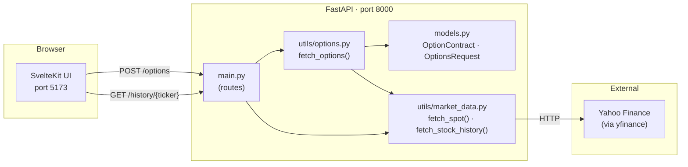
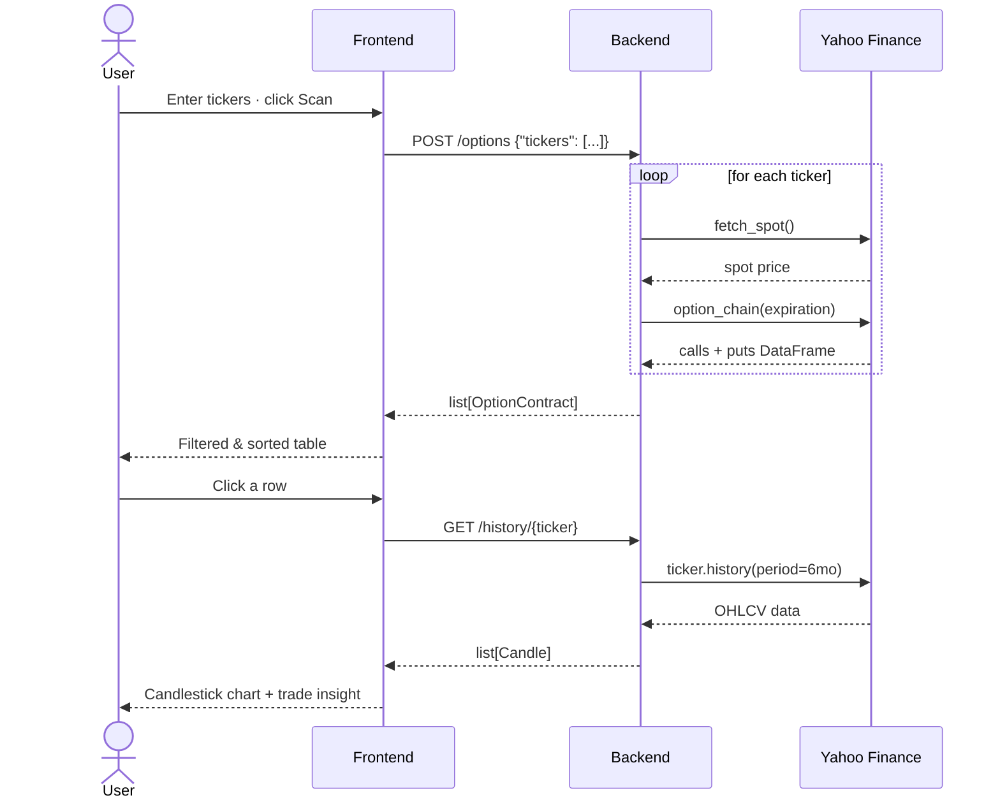

# Options Scanner

A two-service web app that fetches live option chains and displays them in a filterable table alongside a candlestick chart.

## Architecture



## Request Flow



## Stack

| Layer    | Technology                              |
|----------|-----------------------------------------|
| Frontend | SvelteKit 2 · Svelte 5 · Tailwind CSS 4 · lightweight-charts |
| Backend  | FastAPI · yfinance · pandas · Pydantic  |
| Runtime  | Python 3.14 (uv) · Node 20+ (npm)       |

## Quick Start

```bash
# Backend
cd backend
uv run uvicorn app.main:app --reload   # http://localhost:8000

# Frontend (separate terminal)
cd frontend
npm install
npm run dev                            # http://localhost:5173
```
