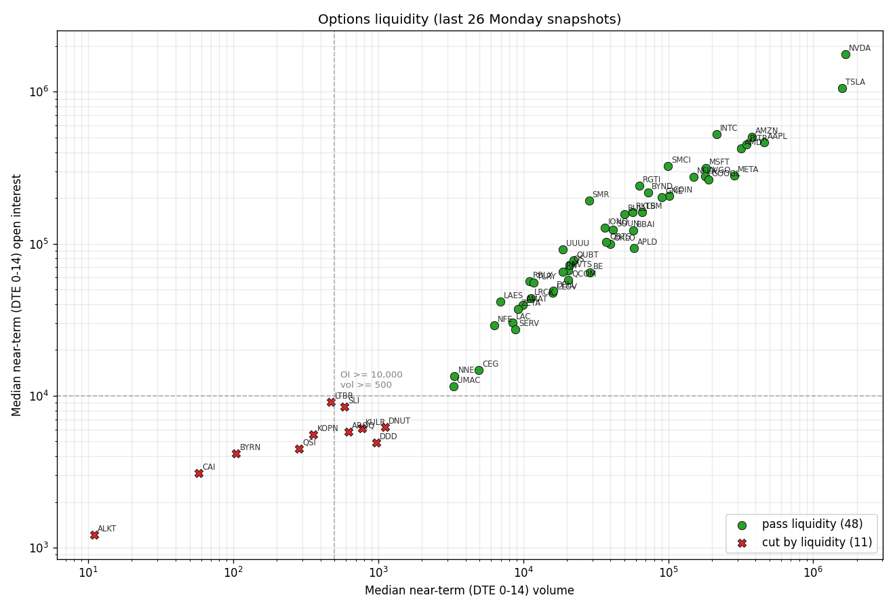
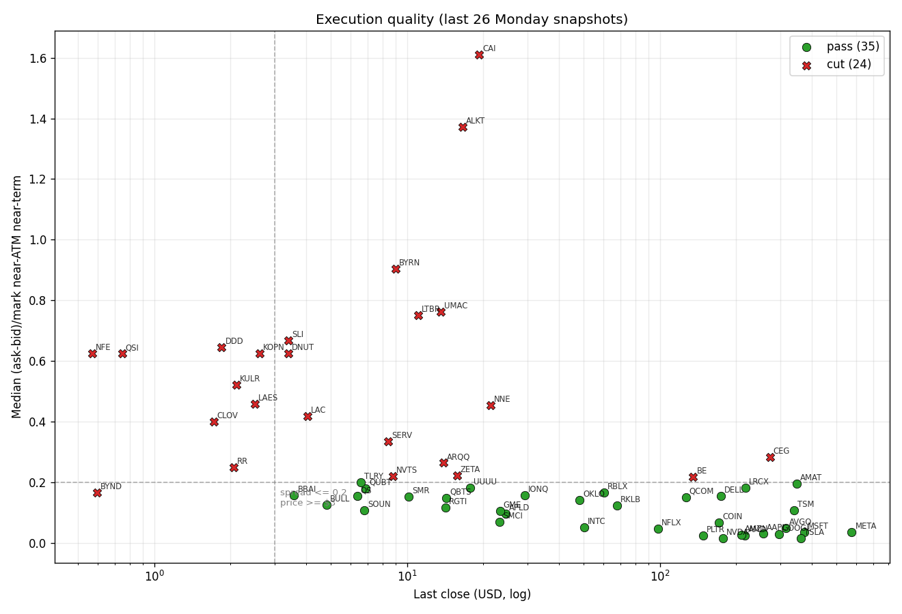
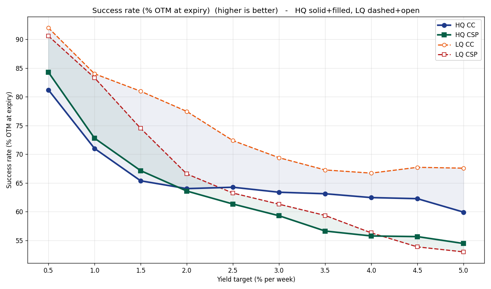
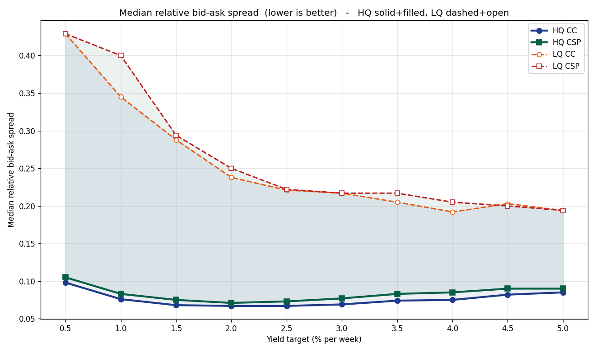
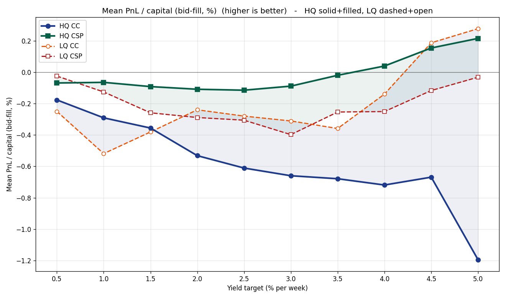
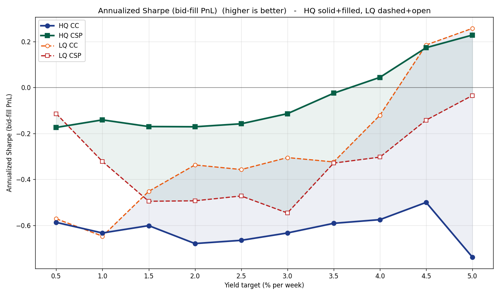
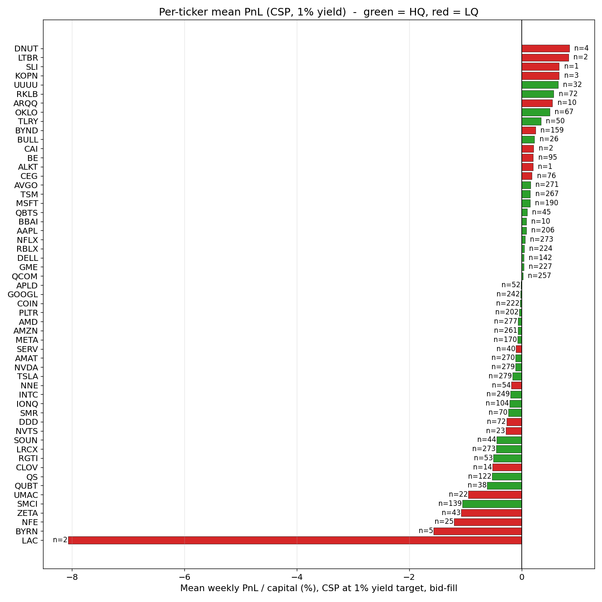
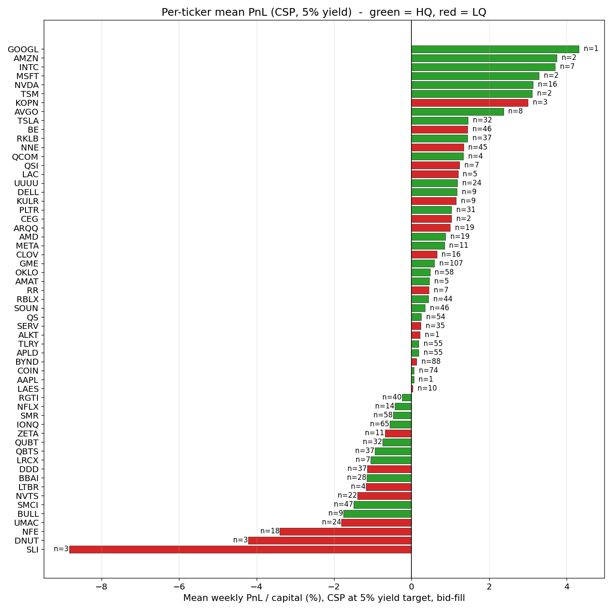
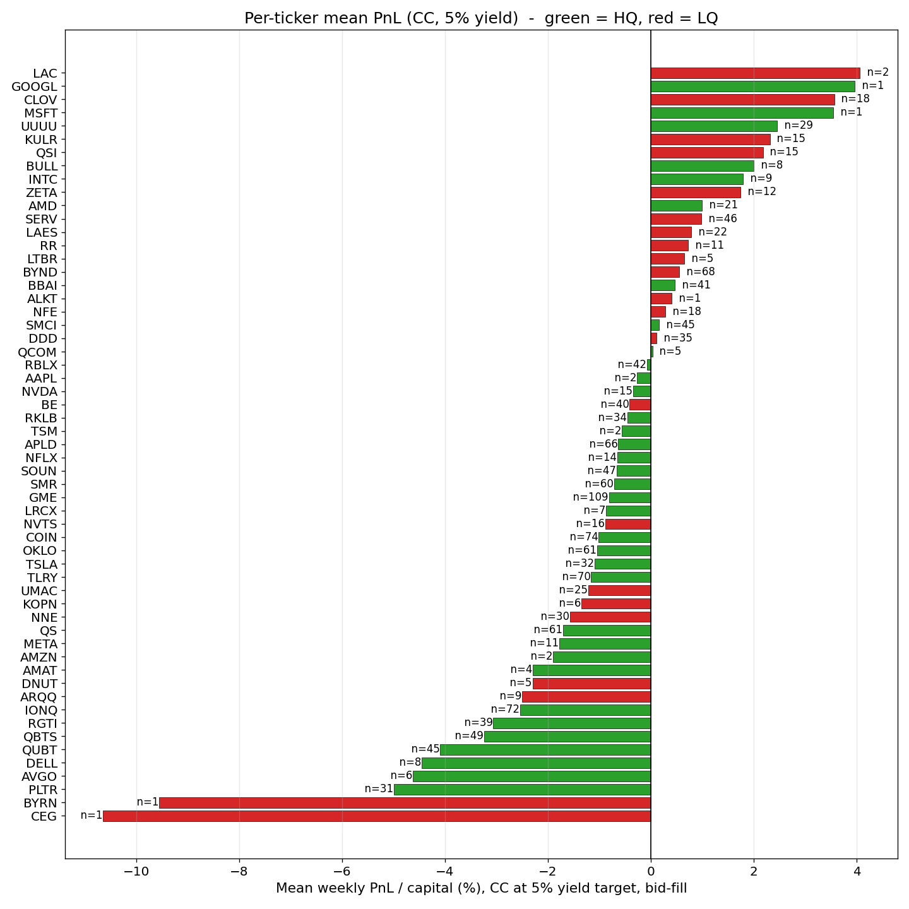
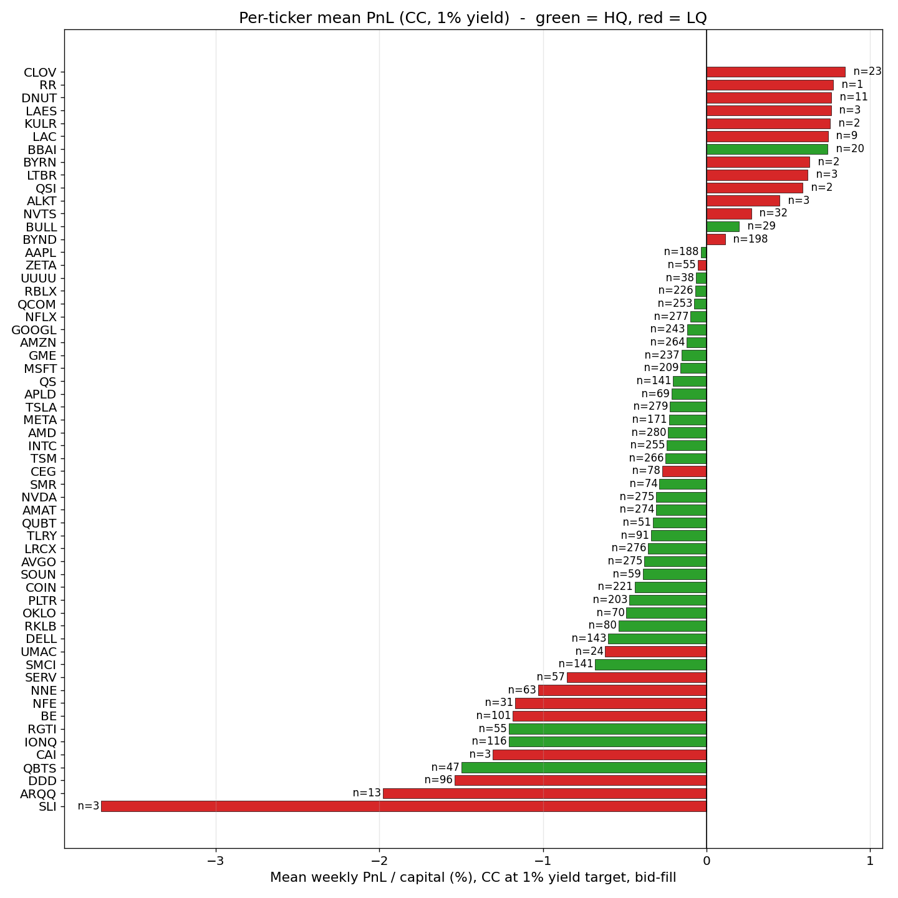

# Experiment journal

- Originally the list has 65 tickers which is the initial watchlist which specified by author's interest which spans across various groups such as AI, energy, semiconductors, quantum computing, robotics, meme stocks, etc. However, not all of them have options data available which is crucial for our project. Therefore, we need to filter out the tickers that do not have options data.

- Six tickers were removed during the filtering process because 5 of them (EXOD, KOSS, QBTQF, QMCO, QNTM) have no options data and 1 of them recently changed its symbol (CCCX changed to INFQ).

- Located at `experiments/data/all_tickers.json` is a list of 59 tickers that have options data available. We will use this list to fetch the historical price data for these tickers from Alpha Vantage and yfinance.

- The production system is going to be using only yfinance to fetch the data to ensure it's free and accessible to everyone. However, in order to build the decision support system, we need to have a comprehensive dataset that includes all the tickers of interest, both historical price data and historical options data. Therefore, we need to use Alpha Vantage Premium API ($59/month) to fetch the historical options data which is not available in yfinance (only current options data is available in yfinance at 15-minute delay).
- Since the system is going to be a separate system where option screener and price prediction are two separate modules, we can use different data sources for each module for experimentation and implementation.
- For the option screener module, we can use Alpha Vantage to fetch the historical options data for all the tickers in our list to backtest our strategies to pick the best options to trade. The output of this experiment will be a set of rules that performed well in the backtesting which can be used in the production system to pick the best options to trade.
- However, since Alpha Vantage historical options data is only available after the market close, we cannot use it in the production system to fetch the current options data. Also the real-time options data from Alpha Vantage is even more expensive than the historical options data plan which is not feasible for our project. Therefore, we need to use yfinance to fetch the current options data in the production system.
- For the price prediction module, we can use yfinance to fetch the historical price data for all the tickers in our list to train our price prediction model. Since this is daily timeframe, the data is free and not limited to 2 years like 1h timeframe and 3 months for lower timeframes. The output of this experiment will be a trained price prediction model that can be used in the production system to predict the future price of the underlying stock which can help us make better decisions when picking options to trade.
- Although we have some idea about using the option data feature to predict the future price of the underlying stock, we are not sure the correct way to integrate the option data feature into the price prediction model. Therefore, we will put this as a future work.

--- After comparing daily charts from both sources, we found that most of the tickers have consistent data which are already adjusted for splits and dividends. However, 7 tickers were removed from the list because of significant discrepancies > $0.1 at some points in the adjusted close price between Alpha Vantage and yfinance which cannot be explained by the difference in data source or the timing of data fetching. These tickers are: AVGO, BYRN, KULR, NFE, QUBT, SERV, SLI. The remaining 52 tickers have good consistency between the two sources and can be used for our experiments.
- A

## Notebook 02: the 59 -> 35 filter funnel

Seven hard filters applied sequentially to the 59-ticker `FILTERED_TICKERS` universe, leaving 35 names in `HIGH_QUALITY_TICKERS`. Attribution is order-sensitive, so each ticker is credited to the first filter it fails. That's why the tree below tells a clean per-ticker story.

- **59 -> 51 | weekly Friday expirations >= 90% of recent Mondays.** 8 monthly-only names cut: `ALKT, ARQQ, BYRN, CAI, KULR, LAC, LTBR, SLI`. Not a quality issue, a product issue - the Monday-close to Friday-close trade is impossible without weeklies. Mostly small-cap thematics (lithium, defense, quantum).
- **51 -> 47 | median near-term OI >= 10,000.** 4 names have weeklies but paper-thin books: `DDD, DNUT, KOPN, QSI`. 3D Systems, Krispy Kreme, Kopin, Quantum-Si - niche names where the options market never developed.
- **47 -> 47 | median near-term volume >= 500.** Zero cuts. Anything with 10k+ OI already clears 500 daily volume, so this filter is pure insurance.

The liquidity panel makes the OI/volume cut visually obvious: every red X sits below `OI=10k` or left of `vol=500`. The green dots above both lines still include tickers that will fail later filters (spread, price) - the scatter only judges liquidity.

- **47 -> 36 | median relative spread <= 20% on sellable contracts.** 11 cuts, the biggest quality drop: `BE, CEG, CLOV, LAES, NFE, NNE, NVTS, RR, SERV, UMAC, ZETA`. They trade, but the bid-ask eats the premium before the position is on. Mix of energy, AI/robotics, and smaller tech. "Can trade, shouldn't."
- **36 -> 36 | non-zero-bid rate >= 0.85 and median bid_size >= 5.** Zero cuts for both. The spread filter already selected for actively-quoted chains.
- **36 -> 35 | last close >= $3.** One casualty: `BYND`. Sub-$3 names can pass every options-market test and still be unusable: at that price level, penny-wide quote granularity dominates the option mid. Arithmetic problem, not a market problem.

The execution-quality panel shows the spread-vs-price story: the upper half (spread > 20%) is where the 11 spread cuts cluster, and the left edge (price < $3) is where BYND lands.

### Observations

- Failure modes cluster cleanly: **structural** (no weeklies) -> **liquidity** (thin book) -> **execution** (wide spreads) -> **arithmetic** (penny stock). Each cut ticker fails for a qualitatively different reason.
- Three filters do all the structural work (weekly, OI, spread). Three are insurance (volume, bid-nonzero, bid-size). One catches a single edge case (price). The insurance filters cost nothing to include and guard against future data drift, but they don't earn their keep on today's universe.
- The 24 cut tickers become the `LQ` universe in notebook 04, which replays the same weekly CC/CSP workflow on them to sanity-check that these cuts actually improved the strategy rather than just shrinking the universe. Result on that plot: HQ wins decisively on spread (the filter's mechanical claim), but LQ's PnL/Sharpe catches up or overtakes HQ at higher yield targets, suggesting the filter is doing its job on execution cost more than on "picking tickers with fundamentally better CC/CSP edge".

In all four panels below: color encodes tier (HQ = navy/teal filled, LQ = orange/crimson open), marker shape encodes type (CC = circle, CSP = square), and the shaded band visualizes the gap between HQ and LQ of the same type.

*Success rate (higher is better).* Counter-intuitive at first: LQ CC sits uniformly above HQ CC, and LQ CSP stays above HQ CSP until they cross around 4-4.5% yield. This is mostly a mechanical artifact of LQ's higher IV - for the same target yield the chosen strike lands deeper OTM on LQ than on HQ, raising P(OTM at expiry). The yield-match filter also biases LQ survivors toward the safer strikes (14k+ LQ attempts failed the 25% tolerance check and were skipped). A higher hit rate here does not imply a better strategy; the next three panels show why.

*Spread (lower is better).* HQ is roughly 3x tighter than LQ across every yield target. This is the filter's cleanest mechanical claim - dropping the low-liquidity names measurably reduces execution cost without any argument about market direction.

*Mean PnL / capital, bid-fill (higher is better).* Spread cost is already priced in via the bid-fill assumption. HQ CSP is the cleanest series: PnL improves monotonically with yield target and turns positive around 4%. Notable inversion on CC: LQ CC actually beats HQ CC at high yield targets (4.5-5%), driven by the same strike-depth effect from panel 1 and by the fact that far-OTM high-IV calls rarely get exercised.

*Annualized Sharpe (higher is better).* Volatility-normalized weekly PnL. HQ CSP climbs smoothly to a meaningfully positive Sharpe (~0.23 at 5% yield). LQ CC jumps positive only at the far right (4.5-5%), but on a thin sample (~400 rows) so the point estimate is noisy. HQ CC and LQ CSP stay in the red across the board. Practical reading: standalone weekly CC on this universe is not an income strategy on its own - it only makes sense as an exit tactic for long positions. Weekly CSP on HQ at high yield targets is the only clean income signal in this grid.

### Per-ticker detail

The aggregate panels collapse across tickers; these per-ticker bar charts expose where the aggregate numbers actually come from. Each bar is one ticker's mean weekly P&L / capital (bid-fill) at the given (type, yield) bucket, sorted ascending. Green = HQ, red = LQ. `n=X` is the number of sampled Mondays contributing to that ticker's mean - **anything below roughly `n ≈ 20` is noise**.

*CSP, 1% yield target.* Almost every HQ ticker sits in a tight band within ±0.5% of zero. The visible extremes are low-sample LQ names (LAC n=2 at -8%, BYRN n=5 at -1.5%) - classic single-outlier bias. At low yield targets the strategy is picking near-ATM strikes on everyone, so week-to-week P&L is dominated by the underlying's move rather than anything structural about the ticker. Nothing to see here yet.

*CSP, 5% yield target.* The distribution fans out dramatically. LQ tickers (SLI, DNUT, NFE, UMAC) dominate the deep-negative tail - their volatile underlyings do breach 5% puts regularly, and when they do the loss is large. The HQ mega-caps at the positive extreme (GOOGL, AMZN, MSFT, TSM) are mostly tiny-sample artifacts (n ≤ 7) because those stocks rarely quote a 5%/week put near the target. The meaningful-sample HQ contributors (NVDA n=16, GME n=107, OKLO n=58, TSLA n=32, RBLX n=44, SMR n=58) post small positive bars around +0.3% to +1.5%. The aggregate "HQ CSP wins at high yield" signal is the sum of many small HQ positives plus the absence of LQ-style tail blowups, not a handful of outperformers.

*CC, 5% yield target.* Inverts the CSP story. The big CC losers are HQ growth names that trended upward over the sample window (PLTR, QUBT, QBTS, RGTI, IONQ, AVGO, DELL) - you sell the 5% call, the stock rips past the strike, you eat the assignment loss. The apparent positive extremes (LAC n=2, GOOGL n=1, MSFT n=1) are tiny-sample noise. The few meaningful positive CC bars (CLOV n=18, UUUU n=29, KULR n=15, QSI n=15, ZETA n=12) are mostly LQ tickers where far-OTM high-IV calls rarely got exercised. Mechanical reading: weekly CC on a growth-tilted universe is systematically short upside vol on names that trend upward, which is why CC Sharpe stays negative across both tiers.

*CC, 1% yield target.* Counterpart to CC 5%, and a useful check on the "LQ CC wins at high yields" story. Everyone clusters slightly negative near zero - at 1% yield the call is near-ATM on every ticker, and any 1-2% upward move of the underlying closes it ITM. The deep-negative tail is again growth names that trended upward over the sample (QBTS n=47, IONQ n=116, RGTI n=55, DDD n=96, BE n=101, NFE n=31). The positive tail is mostly sub-`n=5` noise (SLI, RR, LAES, KULR, BYRN, LTBR, QSI, ALKT), with a few meaningful flat-trenders on top (CLOV n=23, DNUT n=11, NVTS n=32, BBAI n=20, BULL n=29). Key contrast with CC 5%: at 1% yield **LQ CC does not beat HQ CC in aggregate** (in fact the opposite, -0.52% vs -0.29%), because the fat LQ bid-ask spread (~25%) eats almost all of a 1% premium. The LQ-CC-wins-at-high-yield signal from the aggregate chart only materializes once the premium is large enough to survive that spread cost - i.e., 4-5% yield. At 1% yield the spread alone is bigger than the prize.